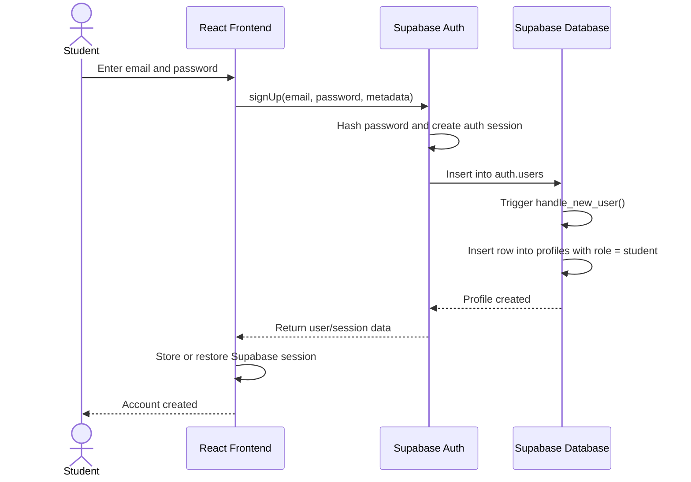
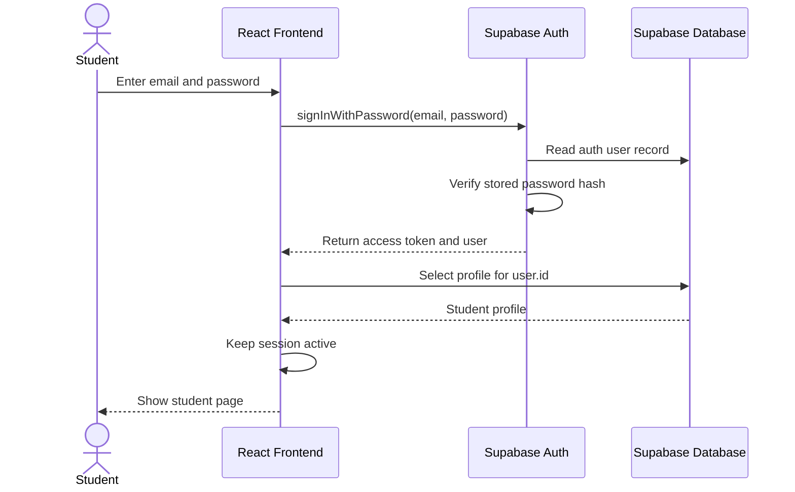
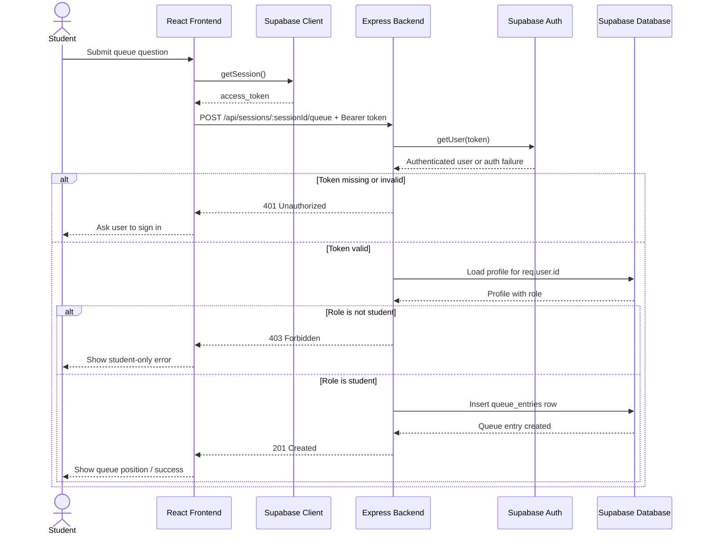

# HelpQ

## Front End Prototype

Issue #9 added the React + Tailwind frontend starter, and Issue #8 expands it
into a student session page in `front-end`. The login flow now uses Supabase
OAuth when `front-end/.env.local` has `VITE_SUPABASE_URL` and
`VITE_SUPABASE_ANON_KEY`, then reads the signed-in user's `public.profiles`
record.

```bash
npm install --prefix front-end
npm run dev:frontend
```

The queue page currently uses local browser state and demo session data while
the backend queue API is still being built.

CI trigger for assignment makeup Open http://127.0.0.1:5173/ for the home
dashboard. Sessions and queues use the Supabase API
(`npm run start --workspace=@helpq/express-backend` on port 3001).

```bash
# Terminal 1 — API (requires Supabase env in packages/express-backend/.env)
npm run start --workspace=@helpq/express-backend

# Terminal 2 — frontend (proxies /api → :3001)
npm run dev:frontend
```

Log in as an instructor account to create office hours, or as a student account
to join queues. Share the session join code from the instructor view.

## TE5 Access Control

HelpQ uses Supabase Auth for account creation, password handling, and
access-token issuance. The frontend signs users up or signs them in with
Supabase, then sends the Supabase access token to the Express backend on
protected requests. The Express backend verifies that bearer token and applies
authorization rules before reading or modifying app data.

### What is already implemented

- Express verifies bearer tokens with Supabase in
  [packages/express-backend/src/middleware/auth.js](packages/express-backend/src/middleware/auth.js).
- Host-only routes already check resource ownership in
  [packages/express-backend/src/routes/api.js](packages/express-backend/src/routes/api.js).
- Student queue submission is now protected.
  `POST /api/sessions/:sessionId/queue` requires a valid bearer token and a
  `student` profile role in
  [packages/express-backend/src/routes/api.js](packages/express-backend/src/routes/api.js).
- A `profiles` table is automatically created from `auth.users`, and its role
  field is used for student access checks in
  [supabase/migrations/20260513120000_add_profiles.sql](supabase/migrations/20260513120000_add_profiles.sql).

### What this means for sign-up and sign-in

If your frontend is using Supabase email/password auth, that already counts as
your sign-up and sign-in flow.

- Sign-up flow: frontend calls `supabase.auth.signUp(...)`
- Sign-in flow: frontend calls `supabase.auth.signInWithPassword(...)`
- Token creation: handled by Supabase
- Password hashing: handled by Supabase
- Protected backend access: handled by sending the Supabase access token to
  Express

Because of that design, you do not need custom Express `/signup` or `/signin`
endpoints unless your team explicitly wants auth to go through your backend
instead of Supabase directly.

**Email on sign-up:** **confirm email ON**, **custom SMTP OFF** (Supabase
default mailer). Configure URLs in the dashboard — see
[docs/SUPABASE_EMAIL_AUTH.md](docs/SUPABASE_EMAIL_AUTH.md).

### What is still missing

- There are still no auth-specific automated tests in this branch.

## Sequence Diagrams

### 1. Sign-up Flow



### 2. Sign-in Flow



### 3. Protected Request: Student Submits a Queue Question



## TE5 Implementation Status

- **Implemented**: Supabase email/password sign-up and sign-in, bearer token
  forwarding from frontend to Express, and backend verification + role/ownership
  checks on protected routes.
- **Implemented**: frontend handles backend `401` / `403` responses with clear
  UI messaging.
- **Still missing**: auth/access-control automated tests.
