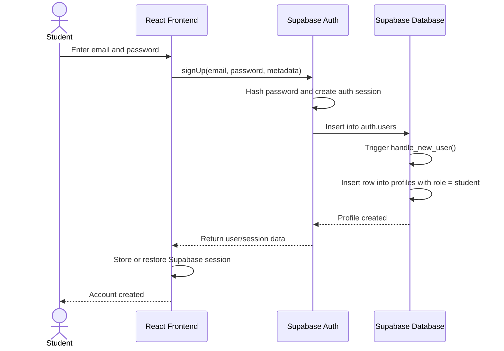
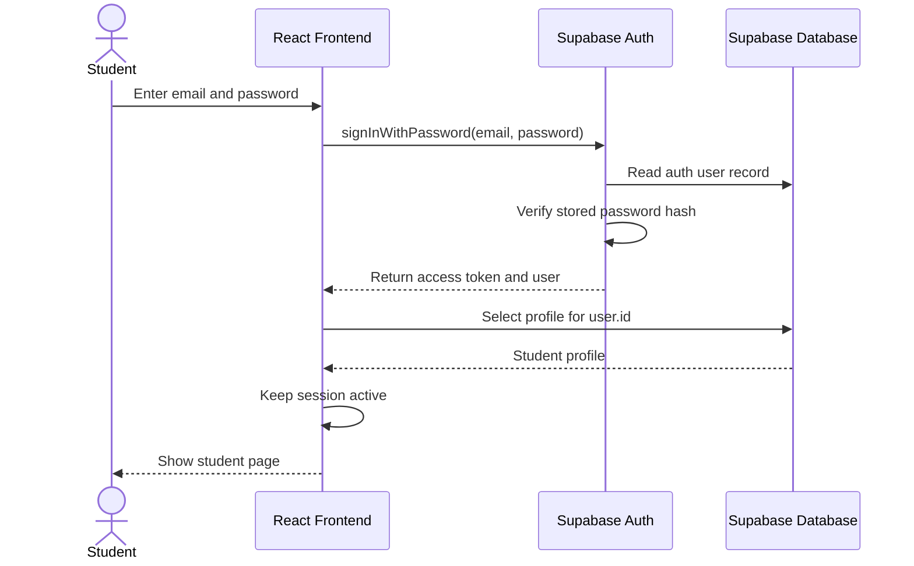
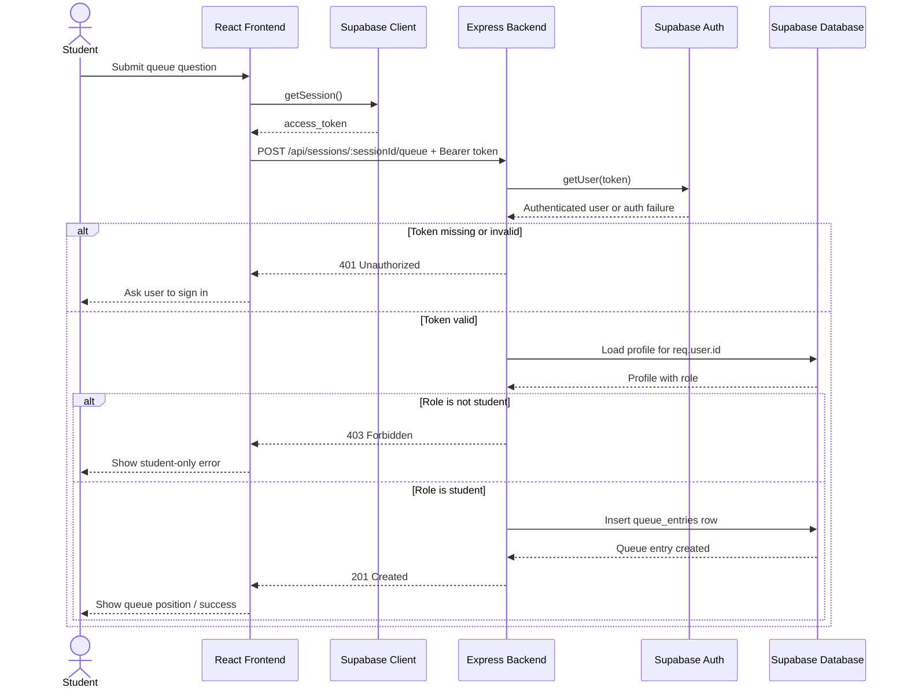

# HelpQ

## TE5 Access Control

HelpQ uses Supabase Auth for account creation, password handling, and access-token issuance. The frontend signs users up or signs them in with Supabase, then sends the Supabase access token to the Express backend on protected requests. The Express backend verifies that bearer token and applies authorization rules before reading or modifying app data.

### What is already implemented

- Express verifies bearer tokens with Supabase in [packages/express-backend/src/middleware/auth.js](/Users/ceyabadyal/CacheMeOutside/HelpQ/packages/express-backend/src/middleware/auth.js:1).
- Host-only routes already check resource ownership in [packages/express-backend/src/routes/api.js](/Users/ceyabadyal/CacheMeOutside/HelpQ/packages/express-backend/src/routes/api.js:27).
- Student queue submission is now protected. `POST /api/sessions/:sessionId/queue` requires a valid bearer token and a `student` profile role in [packages/express-backend/src/routes/api.js](/Users/ceyabadyal/CacheMeOutside/HelpQ/packages/express-backend/src/routes/api.js:185).
- A `profiles` table is automatically created from `auth.users`, and its role field is used for student access checks in [supabase/migrations/20260513120000_add_profiles.sql](/Users/ceyabadyal/CacheMeOutside/HelpQ/supabase/migrations/20260513120000_add_profiles.sql:3).

### What this means for sign-up and sign-in

If your frontend is using Supabase email/password auth, that already counts as your sign-up and sign-in flow.

- Sign-up flow: frontend calls `supabase.auth.signUp(...)`
- Sign-in flow: frontend calls `supabase.auth.signInWithPassword(...)`
- Token creation: handled by Supabase
- Password hashing: handled by Supabase
- Protected backend access: handled by sending the Supabase access token to Express

Because of that design, you do not need custom Express `/signup` or `/signin` endpoints unless your team explicitly wants auth to go through your backend instead of Supabase directly.

### What is still missing

- The frontend must actually send the Supabase bearer token when it calls protected Express routes.
- The frontend must replace demo-only queue/session actions with real `/api/...` requests.
- If sign-up and sign-in UI live only in another branch, they still need to be merged into the branch you submit.
- There are still no auth-specific automated tests in this branch.

## Sequence Diagrams

### 1. Sign-up Flow

### 2. Sign-in Flow

### 3. Protected Request: Student Submits a Queue Question

## Frontend To-Do For TE5

- Use Supabase email/password sign-up if you need first-time account creation in the submitted branch.
- Use Supabase email/password sign-in in the submitted branch.
- After sign-in, call protected Express routes with `Authorization: Bearer <access_token>`.
- Replace mock queue submit logic with a real `POST /api/sessions/:sessionId/queue` request.
- Handle backend `401` and `403` responses in the UI.

## Backend To-Do For TE5

- Student queue submission is now protected.
- Host-only moderation routes are already protected.
- If you want stricter access control, decide whether queue reads and stats should also require auth.
- Add auth/access-control tests when you have time.
