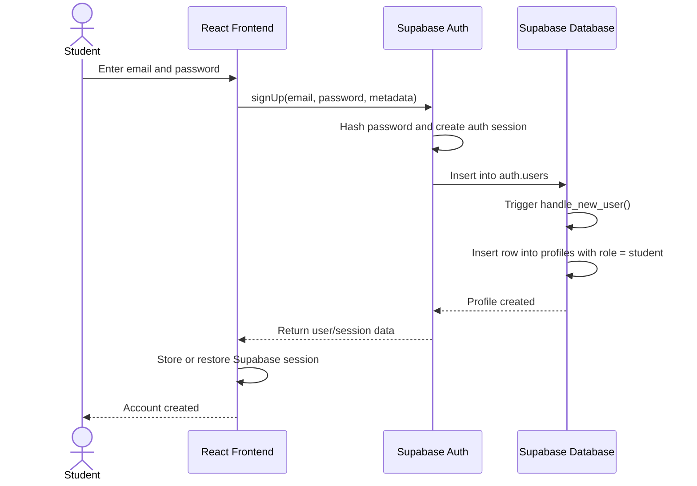
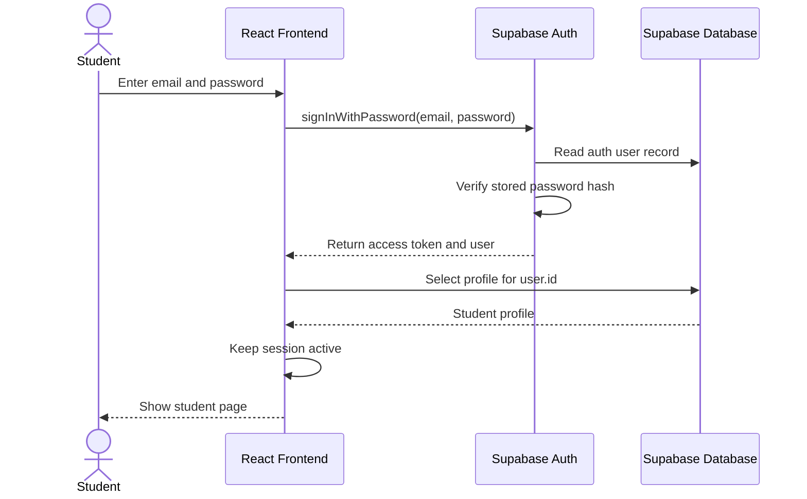
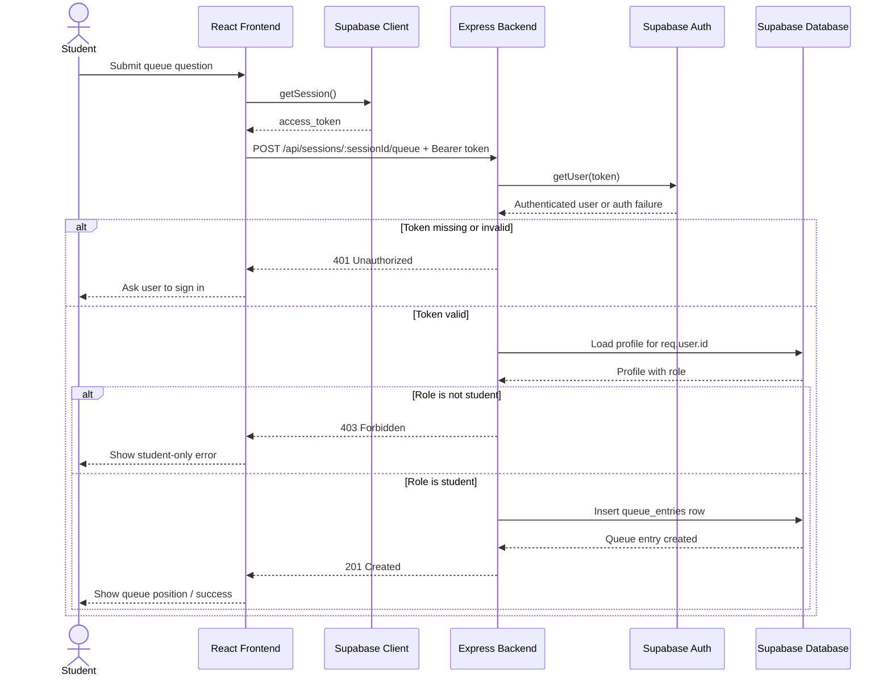

# HelpQ — Office Hours Queue App

HelpQ is a full-stack office hours help queue. A host (instructor or TA) creates a session and shares a join code; students join with their name and question and see their position in line. Hosts manage the queue and mark students as helped.

---

## Features

- **Session codes** — host creates a session, shares a short join code with students
- **Queue management** — entries ordered by `joinedAt`; status transitions: `waiting` → `in_progress` → `done`
- **Host controls** — update queue entry status, remove entries; protected by auth + ownership checks
- **Auth (Supabase email/password)** — sign up, sign in; access tokens forwarded to Express backend
- **Role-based access** — `instructor` and `student` roles enforced on protected routes
- **Classes and office hours scheduling** — instructors create classes, schedule recurring office-hours slots
- **Tested backend APIs** — Jest + Supertest coverage for session, queue, access-control, and validation routes

---

## Tech Stack

| Layer | Technologies |
|-------|-------------|
| Frontend | React, Vite, Tailwind CSS |
| Backend | Node.js, Express |
| Database | Supabase (PostgreSQL), schema migrations, RLS policies |
| Auth | Supabase email/password auth, Bearer token middleware |
| Testing | Jest, Supertest |
| Tooling | ESLint, Prettier |

---

## Running Locally

Open `http://127.0.0.1:5173/` for the home dashboard. Sessions and queues use the Supabase API.

```bash
# Terminal 1 — API (requires Supabase env in packages/express-backend/.env)
npm run start --workspace=@helpq/express-backend

# Terminal 2 — frontend (proxies /api → :3001)
npm run dev:frontend
```

Log in as an instructor account to create office hours, or as a student account to join queues. Share the session join code from the instructor view.

See `packages/express-backend/.env.example` and `front-end/.env.example` for required environment variables, and `packages/express-backend/SUPABASE_SETUP.md` for Supabase project setup.

---

## Running Tests

```bash
cd packages/express-backend
npm test
```

Test coverage includes access control, API validation, and student queue access.

---

## Database Schema

Key tables (see `supabase/migrations/` for full schema):

| Table | Description |
|-------|-------------|
| `sessions` | Office hours sessions; indexed by `host_id` and `join_code` |
| `queue_entries` | Queue entries ordered by `joined_at`; cascade-delete on session removal |
| `profiles` | User profiles with `role` field; auto-created via `handle_new_user` trigger |
| `classes` | Instructor-created classes with enrolled students |
| `office_hours_schedules` | Recurring office-hours schedule slots per class/host |

RLS policies restrict data access by ownership. Supabase realtime publication is enabled for queue entries.

---

## Auth & Access Control

HelpQ uses Supabase Auth for account creation, password handling, and access-token issuance. The frontend signs users up or signs them in with Supabase, then sends the Supabase access token to the Express backend on protected requests. The Express backend verifies that bearer token and applies authorization rules before reading or modifying app data.

### What is implemented

- Express verifies bearer tokens with Supabase in
  [packages/express-backend/src/middleware/auth.js](packages/express-backend/src/middleware/auth.js).
- Host-only routes check resource ownership in
  [packages/express-backend/src/routes/api.js](packages/express-backend/src/routes/api.js).
- Student queue submission is protected: `POST /api/sessions/:sessionId/queue` requires a valid bearer token and a `student` profile role.
- A `profiles` table is automatically created from `auth.users`, and its role field is used for student access checks in
  [supabase/migrations/20260513120000_add_profiles.sql](supabase/migrations/20260513120000_add_profiles.sql).

### Sign-up and sign-in

- Sign-up: frontend calls `supabase.auth.signUp(...)`
- Sign-in: frontend calls `supabase.auth.signInWithPassword(...)`
- Token creation and password hashing: handled by Supabase
- Protected backend access: send the Supabase access token as a Bearer token to Express

**Email on sign-up:** confirm email ON, custom SMTP OFF (Supabase default mailer). Configure URLs in the dashboard — see [docs/SUPABASE_EMAIL_AUTH.md](docs/SUPABASE_EMAIL_AUTH.md).

---

## Sequence Diagrams

### 1. Sign-up Flow



### 2. Sign-in Flow



### 3. Protected Request: Student Submits a Queue Question



---

## Known Limitations

- Supabase realtime publication exists in migrations, but a full live-push queue update UI is not yet fully wired end-to-end.
- Auth-specific automated tests are still missing.
