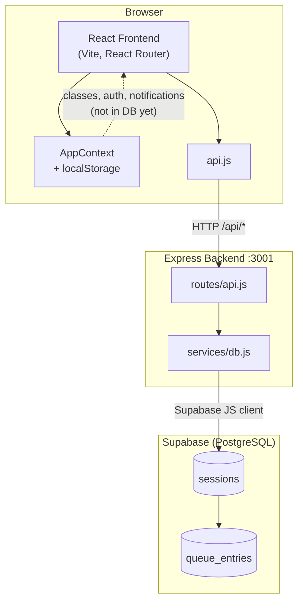
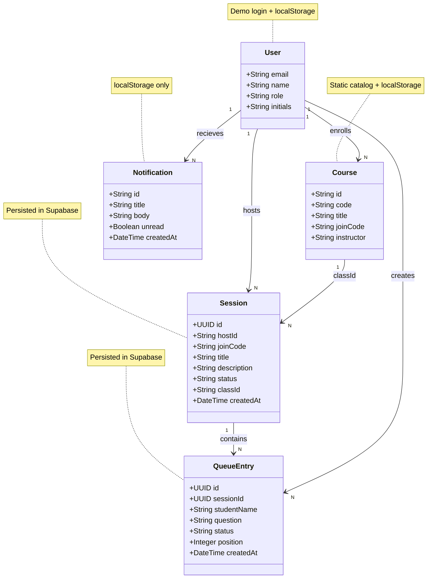
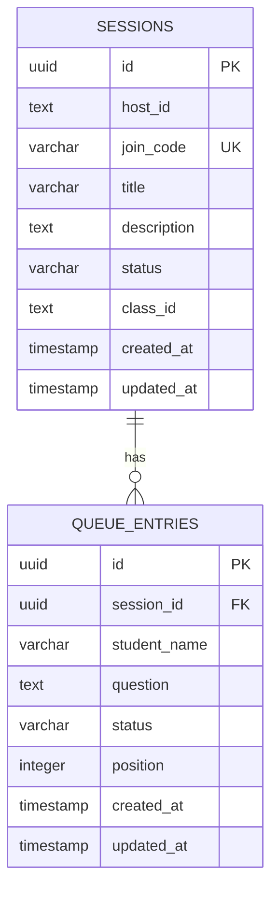
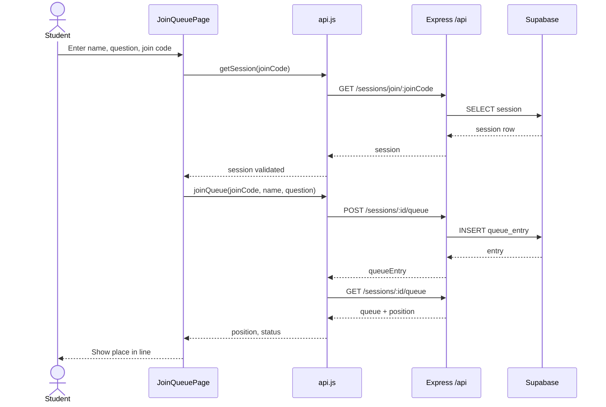
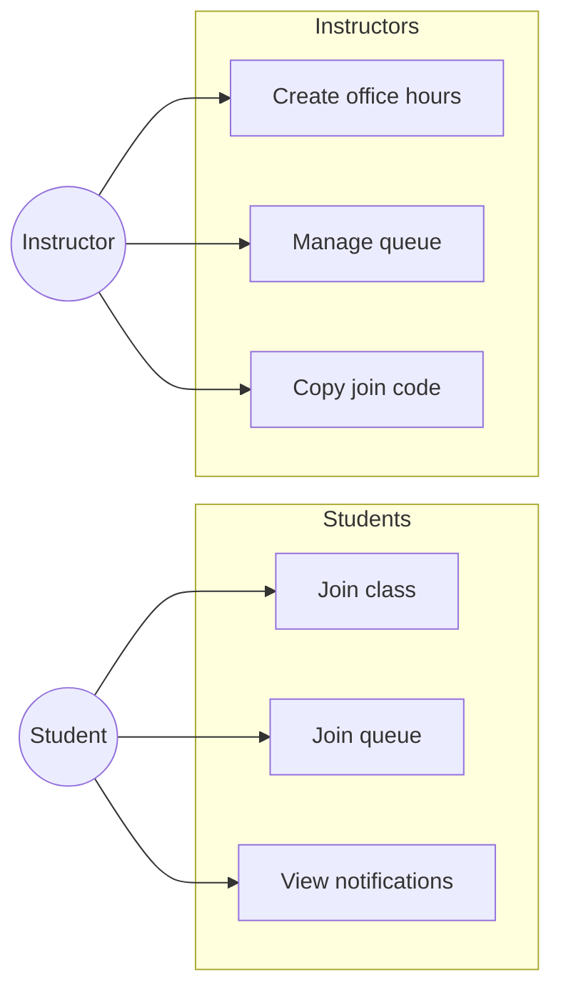

# HelpQ — UML Diagrams

Architecture and domain models for the HelpQ office-hours queue system. Render Mermaid blocks in [Mermaid Live](https://mermaid.live), GitHub, or VS Code with a Mermaid preview extension.

| Need | Diagram |
|------|---------|
| Architecture / tech stack | [Component](#1-component-diagram-system-architecture) |
| OOP / domain model | [Class](#2-class-diagram-domain-model) |
| Database design | [ER](#3-entity-relationship-diagram-database) |
| Key workflow | [Sequence — join queue](#4-sequence-diagram--student-joins-queue) |
| Requirements / actors | [Use case](#5-use-case-diagram-actors) |

---

## 1. Component diagram (system architecture)

React app, Express API, and Supabase.

---

## 2. Class diagram (domain model)

**Persisted in Supabase:** `Session`, `QueueEntry`. **Frontend / local only (for now):** `User`, `Course`, `Notification`.

**Queue entry statuses (API):** `waiting` → `in_progress` → `completed`. The UI maps `in_progress` to “helping” where needed.

---

## 3. Entity-relationship diagram (database)

Tables in Supabase today.

---

## 4. Sequence diagram — student joins queue

End-to-end flow through the API.

---

## 5. Use case diagram (actors)

High-level capabilities by role.

