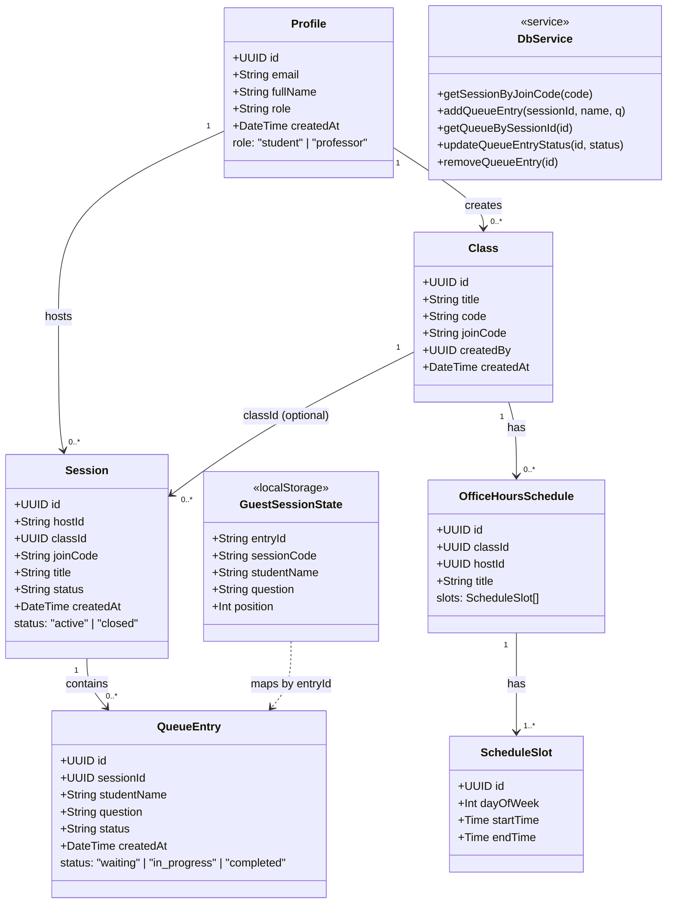
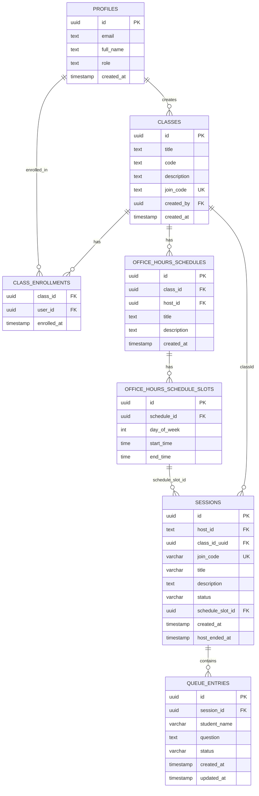
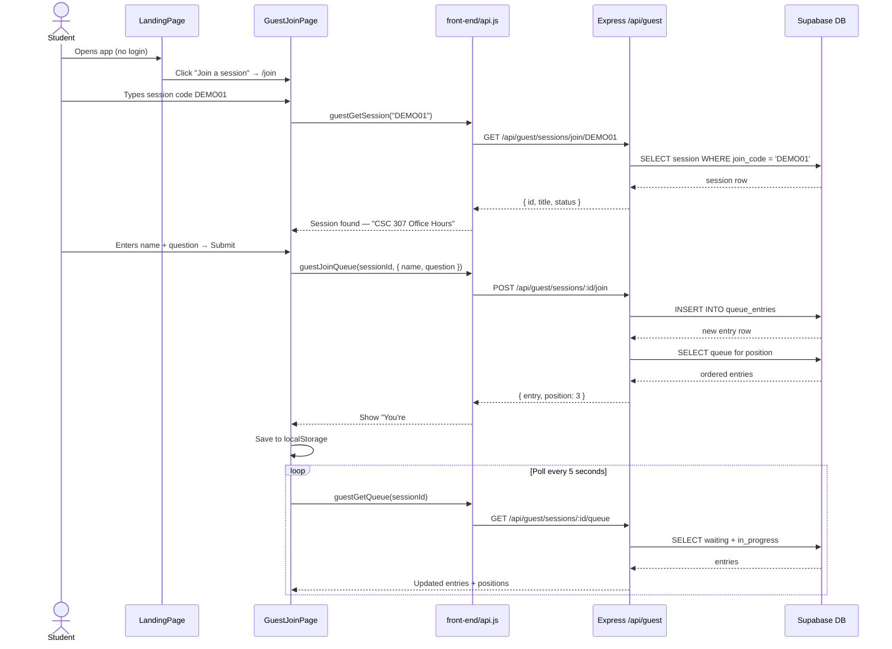
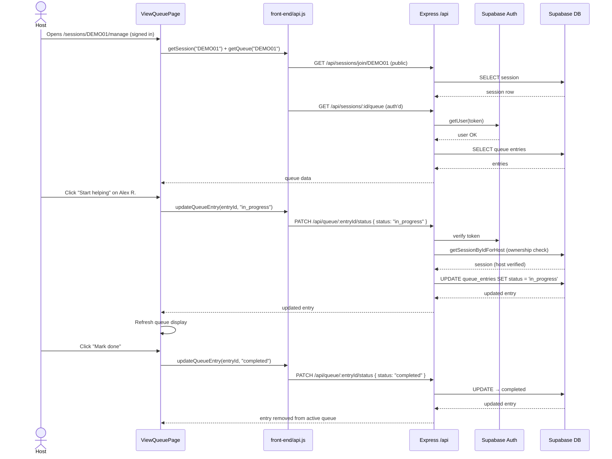
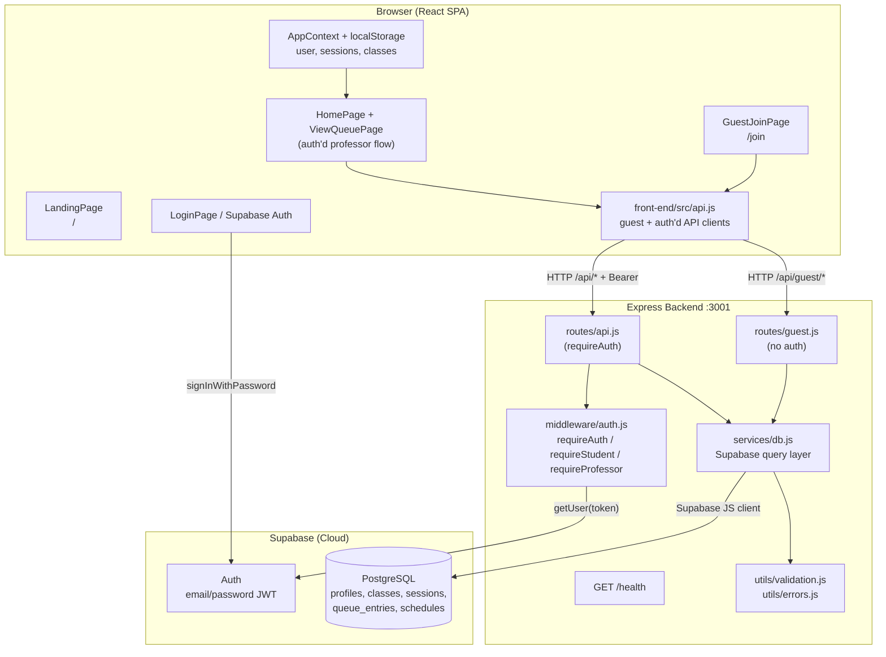
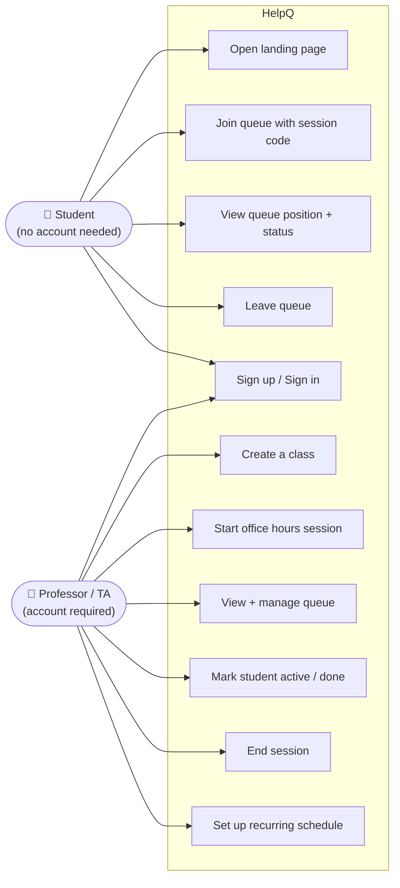

# HelpQ — UML Diagrams

**Last updated:** 2026-05-31

The source diagrams are written in [Mermaid](https://mermaid.js.org/) and render inline on GitHub, in VS Code (with Mermaid Preview extension), or at [mermaid.live](https://mermaid.live).

| Diagram | Purpose |
|---------|---------|
| [Class diagram](#class-diagram) | Domain model — persistent entities and service modules |
| [Entity-relationship](#entity-relationship-diagram) | Database schema (Supabase/PostgreSQL) |
| [Sequence — student joins](#sequence-diagram--guest-student-joins-queue) | Guest flow end-to-end |
| [Sequence — host marks done](#sequence-diagram--host-marks-student-done) | Professor queue management |
| [Component diagram](#component-diagram) | System architecture overview |
| [Use case diagram](#use-case-diagram) | Actor interactions |

**Source file:** [`docs/diagrams/helpq-class-diagram.mmd`](diagrams/helpq-class-diagram.mmd)

> Note: Additional UML diagrams for the original SRD are in the root [`UML.md`](../UML.md).

---

## Class Diagram

Domain model showing persisted entities, backend service module, and frontend state.

---

## Entity-Relationship Diagram

Tables in Supabase PostgreSQL (current schema from `supabase/migrations/`).

---

## Sequence Diagram — Guest Student Joins Queue

---

## Sequence Diagram — Host Marks Student Done

---

## Component Diagram

System architecture — tech stack and layers.

---

## Use Case Diagram

